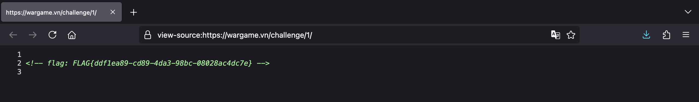
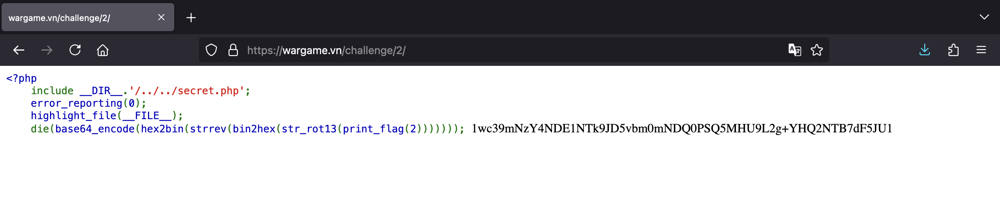
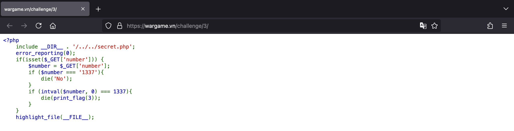
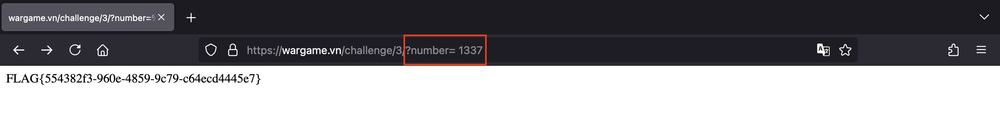
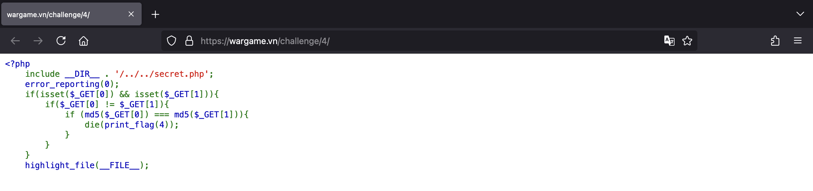
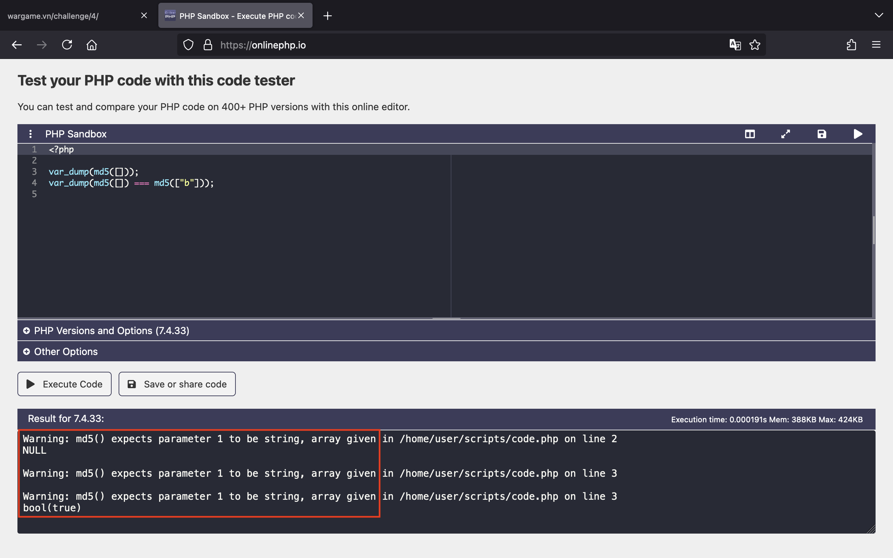
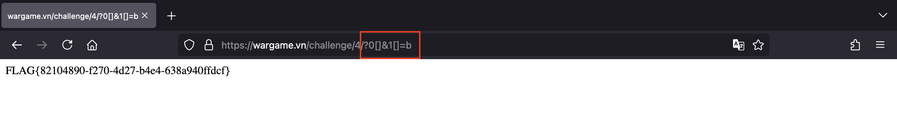

# PHP101

## Challenge 1

Bắt đầu với một thử thách siêu đơn giản, chúng ta chỉ cần xem HTML source của trang web bằng cách nhấn tổ hợp phím `Command + U` trên MacOS (hoặc `Ctrl + U` trên Windows) là có được flag.



## Challenge 2



Thử thách này tác giả cho chúng ta biết chuỗi flag đã bị mã hoá và đoạn code PHP của trang web.

Chúng ta có thể thấy, flag ban đầu được xử lý lần lượt qua các hàm theo thứ tự như sau:

1. `str_rot13()`
2. `bin2hex()`
3. `strrev()`
4. `hex2bin()`
5. `base64_encode()`

Vậy chúng ta sẽ thực hiện ngược lại đối với chuỗi flag đã bị mã hoá.

Mình có viết đoạn script PHP bên dưới để nhận về flag ban đầu.

```php
<?php
$encodedFlag = "1wc39mNzY4NDE1NTk9JD5vbm0mNDQ0PSQ5MHU9L2g+YHQ2NTB7dF5JU1";

$flag = base64_decode($encodedFlag);
$flag = bin2hex($flag);
$flag = strrev($flag);
$flag = hex2bin($flag);
$flag = str_rot13($flag);

echo $flag; # FLAG{c564ca8b-5c94-4446-aba4-955148676bfc}

```

## Challenge 3

Ở thử thách này, chúng ta được yêu cầu nhập vào giá trị thông qua tham số `number`, nếu đúng bằng số `1337` mới nhận được flag. Tuy nhiên, chúng ta không thể nhập thẳng vào số `1337`.



Nhưng do có hàm `intval($number, 0)` nên chúng ta có thể sử dụng các cách bên dưới để giá trị của `number` được chuyển đổi thành số `1337`. Từ đó, chúng ta sẽ lấy flag thành công.




## Challenge 4



Chúng ta được yêu cầu nhập vào 2 tham số `0` và `1` chứa giá trị khác nhau nhưng giá trị MD5 hash của chúng phải giống nhau.

Do server sử dụng phiên bản PHP 7.4.33 nên chúng ta có thể truyền vào lần lượt 2 mảng chứa giá trị khác nhau để khiến cho hàm `md5()` trả về `NULL` và khi so sánh sẽ trả về `true`.



Vậy chúng ta thêm `?0[]&1[]=b` vào URL và gửi request sẽ có được flag.


