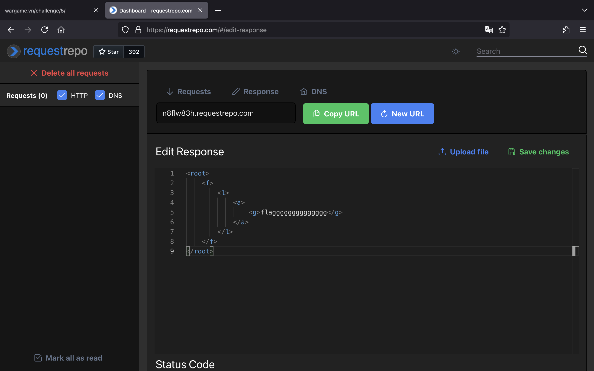
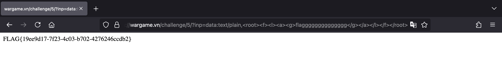

# PHP101

## Challenge 1

Bắt đầu với một thử thách siêu đơn giản, chúng ta chỉ cần xem HTML source của trang web bằng cách nhấn tổ hợp phím `Command + U` trên MacOS (hoặc `Ctrl + U` trên Windows) là có được flag.


## Challenge 2


Thử thách này tác giả cho chúng ta biết chuỗi flag đã bị mã hoá và đoạn code PHP của trang web.

Chúng ta có thể thấy, flag ban đầu được xử lý lần lượt qua các hàm theo thứ tự như sau:

1. `str_rot13()`
2. `bin2hex()`
3. `strrev()`
4. `hex2bin()`
5. `base64_encode()`

Vậy chúng ta sẽ thực hiện ngược lại đối với chuỗi flag đã bị mã hoá.

Mình có viết đoạn script PHP bên dưới để nhận về flag ban đầu.

```php
<?php
$encodedFlag = "1wc39mNzY4NDE1NTk9JD5vbm0mNDQ0PSQ5MHU9L2g+YHQ2NTB7dF5JU1";

$flag = base64_decode($encodedFlag);
$flag = bin2hex($flag);
$flag = strrev($flag);
$flag = hex2bin($flag);
$flag = str_rot13($flag);

echo $flag; # FLAG{c564ca8b-5c94-4446-aba4-955148676bfc}

```

## Challenge 3

Ở thử thách này, chúng ta được yêu cầu nhập vào giá trị thông qua tham số `number`, nếu đúng bằng số `1337` mới nhận được flag. Tuy nhiên, chúng ta không thể nhập thẳng vào số `1337`.


Nhưng do có hàm `intval($number, 0)` nên chúng ta có thể sử dụng các cách bên dưới để giá trị của `number` được chuyển đổi thành số `1337`. Từ đó, chúng ta sẽ lấy flag thành công.


## Challenge 4


Chúng ta được yêu cầu nhập vào 2 tham số `0` và `1` chứa giá trị khác nhau nhưng giá trị MD5 hash của chúng phải giống nhau.

Do server sử dụng phiên bản PHP 7.4.33 nên chúng ta có thể truyền vào lần lượt 2 mảng chứa giá trị khác nhau để khiến cho hàm `md5()` trả về `NULL` và khi so sánh sẽ trả về `true`.


Vậy chúng ta thêm `?0[]&1[]=b` vào URL và gửi request sẽ có được flag.


## Challenge 5


Tại thử thách này, chúng ta được yêu cầu nhập vào một tham số `inp` thông qua URL.

Trong source code, chúng ta để ý dữ liệu truyền vào tham số `inp` được đưa tới hàm `file_get_contents()`, hàm này được dùng để đọc file, ngoài ra nếu chúng ta truyền vào URL, nó cũng thực hiện gửi HTTP request và trả về response.

Còn hàm `simplexml_load_string()` được dùng để chuyển đổi chuỗi dữ liệu XML thành SimpleXMLElement object, cho phép chúng ta làm việc với dữ liệu XML trong PHP.

Nếu chuỗi nằm trong phần tử `g` của XML là `flagggggggggggggg`, thì chúng ta sẽ nhận được flag.

Với đoạn XML sau, chúng ta cùng kiểm tra trên [PHP Sandbox](https://onlinephp.io/).

```xml
<root>
    <f>
        <l>
            <a>
                <g>flagggggggggggggg</g>
            </a>
        </l>
    </f>
</root>
```


Có thể lấy ra chuỗi `flagggggggggggggg`. Vậy làm sao để chúng ta truyền được chuỗi XML trên thông qua tham số `inp`?

Một điều tuyệt vời là hàm `file_get_contents($inp)` có thể gửi HTTP request như mình đã nói ở trên. Do đó, chúng ta sẽ lưu chuỗi XML vào response của [requestrepo](https://requestrepo.com) và lấy URL truyền vào tham số `inp` để khiến hàm đó về chuỗi XML.



Thành công, chúng ta đã lấy được flag:


Ngoài ra, chúng ta cũng có thể sử dụng một số payload sau bằng cách tận dụng [Data URL](https://developer.mozilla.org/en-US/docs/Web/URI/Schemes/data).

```text
data:text/plain,<root><f><l><a><g>flagggggggggggggg</g></a></l></f></root>
```

```text
data:text/,<root><f><l><a><g>flagggggggggggggg</g></a></l></f></root>
```

```text
data:,<root><f><l><a><g>flagggggggggggggg</g></a></l></f></root>
```



## Challenge 6


Thử thách này yêu cầu chúng ta nhập dữ liệu vào tham số `number`, nếu có thể chuyển đổi giá trị đó thành số khác 0 thì chúng ta nhận được flag. Tuy nhiên, tác giả đã sử dụng hàm `preg_match('/[0-9]/', $number)` để chặn chúng ta nhập vào số.

Vậy để bypass thành công, chúng ta sẽ truyền vào một mảng `number` thay vì chuỗi thông thường.


## Challenge 7


Thử thách này khá thú vị, nếu đọc code ngay trên trang web, chúng ta thấy để lấy được flag cần phải nhập vào một mảng `u` bằng với mảng `['admin', 'lord']`. Tuy nhiên, phần tử thứ nhất của mảng là `u[0]` lại không được phép là `admin`. Vậy phải làm cách nào đây?

Nếu chúng ta copy code vào VS Code sẽ thấy điều đặc biệt, ký tự `u` đầu tiên đã được thêm một ý tự đặc biệt vào phía sau. Do đó, 2 tham số `u⁠` và `u` này là hoàn toàn khác nhau.


Copy và search Google, chúng ta sẽ biết được thông tin về ký tự đặc biệt này.


Vậy, chúng ta sẽ thêm phần query string bên dưới vào để lấy flag thành công. Chú ý là không cần nhập vào mảng `u[]` bởi khi nhập `u=xxx` thì `$_GET['u'][0]` sẽ trả về `x`, từ đó thoả mãn điều kiện `$_GET['u'][0] !== 'admin'`.

```text
?u%E2%81%A0[]=admin&u%E2%81%A0[]=lord&u=xxx
```


## Challenge 8


Trang web yêu cầu chúng ta nhập dữ liệu qua tham số `u`, nếu giá trị của `u` khác `admin` thì sẽ thực hiện decode URL giá trị đó, giá trị sau khi decode nếu bằng `admin` thì mới trả về flag.

Vậy, chúng ta sẽ encode URL chuỗi `admin` 2 lần (Double URL Encoding) để bypass qua phần kiểm tra `if(preg_match('/admin/', $_GET['u'])) die('no no no');`.

Chúng ta có thể sử dụng luôn tính năng Decoder trong Burp Suite để thực hiện.


Lưu ý là khi chúng ta truyền `%25%36%31%25%36%34%25%36%64%25%36%39%25%36%65` vào tham số `u` nó sẽ được trình duyệt chuyển đổi thành `%2561%2564%256d%2569%256e` là bởi trình duyệt decode trở lại `%61%64%6d%69%6e` và chỉ encode duy nhất ký tự `%` thành `%25`.


## Challenge 9


Thử thách này yêu cầu chúng ta nhập vào chuỗi dưới 28 kí tự thông qua tham số `say`. Nếu chuỗi có `give_me_the_flag` thì chúng ta sẽ nhận được flag.

Tuy nhiên, tác giả đã dùng hàm `preg_replace('/^(.*)flag(.*)$/', 'waf', $_GET['say']);` để thay thế chuỗi chứa từ `flag` thành `waf`.

Vậy chúng ta sẽ bypass bằng cách nào đây?

Chúng ta sẽ tận dụng dấu ngắt dòng bởi vì dấu `.` trong regex sẽ không khớp với nó.


Chúng ta tạo payload bằng cách thực hiện encode URL dấu ngắt dòng thành `%0A`, sau đó thêm vào trước chuỗi `give_me_the_flag`.

Truyền payload vào tham số `say` và gửi request, chúng ta sẽ lấy được flag.


## Challenge 10


Thử thách này liên quan đến việc thực hiện khai thác Deserialization cũng như bypass tên tham số trong PHP. Một thử thách tương tự là [Sekai Game Start](https://github.com/project-sekai-ctf/sekaictf-2022/tree/main/web/sekai-game-start) trong SekaiCTF 2022.

Chúng ta có thể thấy, server mong muốn nhận vào một chuỗi ở dạng serialized từ tham số `get_flag.php` trong URL. Tuy nhiên, PHP sẽ tự động chuyển đổi ký tự `.` thành ký tự `_` trong tên tham số nên chúng ta không thể đi vào khối `if`. Tham khảo tại [PHP GET url param with dot in name](https://stackoverflow.com/questions/33126289/php-get-url-param-with-dot-in-name).


Chúng ta có thể bypass bằng cách đổi ký tự `_` trong tên tham số thành ký tự `[` để khiến PHP tự động chuyển nó lại thành `_` mà vẫn giữ nguyên dấu `.`. Từ đó, chúng ta có được tên key chính xác:


Tiếp đến, chúng ta cùng phân tích class `Get_Flag`, nó có 2 magic methods là `__destruct()` và `__wakeup()`.

Tại method `__destruct()`, thực hiện kiểm tra nếu thuộc tính `get` là `True` thì trả về flag cho chúng ta. Method này tự động thực thi khi đến cuối script.

```php
public function __destruct() {
    if ($this->get === True) {
        die(print_flag(10));
    }
}
```

Tại method `__wakeup()`, thực hiện gán lại giá trị của thuộc tính `get` thành `False`. Method này được thực thi khi gọi hàm `unserialize()`. Tức là nó sẽ được thực thi trước method `__destruct()`.

```php
public function __wakeup() {
    $this->get = False;
}
```

Vậy, nếu chúng ta gọi hàm `unserialize()` với chuỗi `O:8:"Get_Flag":1:{s:3:"get";b:1;}` thì thuộc tính `get` sẽ luôn là `False` khi nó được kiểm tra trong hàm `__destruct()` và chúng ta không thể nhận được flag.

Theo bài report [Bug #81151](https://bugs.php.net/bug.php?id=81151), chúng ta có thể khiến hàm `__wakeup()` không được thực thi bằng cách truyền vào hàm `unserialize()` chuỗi `C:8:"Get_Flag":0:{}`.

Vậy sử dụng payload cuối cùng bên dưới chúng ta sẽ có được flag.

```text
?get[flag.php=C:8:"Get_Flag":0:{}
```


